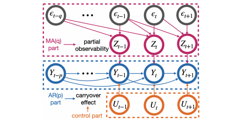

# ARMA Design Implementation for "Optimal Treatment Allocation Strategies for A/B Testing in Partially Observable Time Series Experiments"

This repository contains the Python implementation of our two ARMA designs as well as other considered baselines in the synthesis data from a dispatch simulator, the **first environment** of the paper "[Optimal Treatment Allocation Strategies for A/B Testing in Partially Observable Time Series Experiments](https://arxiv.org/pdf/2408.05342)". 

<p align="center">
    
</p>

## Run the Code
### Step 1: Evaluate the True ATE

```
python ARMAdesign.py --num_sim 30 --p 2 --q 2 --order 2 --num 1 --num_epi_ate 100000
```

### Step 2: Evaluate the Efficiency Indicators

```
python ARMAdesign.py --num_sim 30 --p 0 --q 0 --order 2 --num_epi_order 500 --num 1
```

### Step 3: Compare the Efficiency of Different Designs

```
python ARMAdesign.py --num_sim 50 --p 2 --q 2 --order 2 --num_epi 50 --num 1
```

## Acknowledgement

We refer to the implementation of [the original dispatch similator](https://github.com/callmespring/MDPOD). The TMDP and NMDP baselines are adapted from the [original implementation](https://github.com/tingstat/MDP_design) of ["Optimal Treatment Allocation for Efficient Policy Evaluation in Sequential Decision Making(NeurIPS 2023)"](https://openreview.net/pdf?id=EcReRm7q9p)

## Contact

Please contact ksun6@ualberta.ca if you have any questions.

## Reference
Please cite our paper if you use our implementation in your research:
```
@article{sun2024optimal,
  title={Optimal Treatment Allocation Strategies for A/B Testing in Partially Observable Time Series Experiments},
  author={Sun, Ke and Kong, Linglong and Zhu, Hongtu and Shi, Chengchun},
  journal={arXiv preprint arXiv:2408.05342},
  year={2024}
}
```

