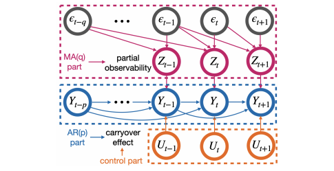

# Implementation for "ARMA-Design: Optimal Treatment Allocation Strategies for A/B Testing in Partially Observable Time Series Experiments"

This repository contains the Python implementation of our two ARMA designs as well as other considered baselines of the paper "[Optimal Treatment Allocation Strategies for A/B Testing in Partially Observable Time Series Experiments](https://arxiv.org/pdf/2408.05342)". 

## Summary of this paper

Time series experiments, in which experimental units receive a sequence of treatments over time, are frequently employed in many technological companies to evaluate the performance of a newly developed policy, product, or treatment relative to a baseline control. Many existing A/B testing solutions assume a fully observable experimental environment that satisfies the Markov condition, which often does not hold in practice.

This paper studies the optimal design for A/B testing in partially observable environments. We introduce a controlled (vector) autoregressive moving average model to capture partial observability. We introduce a small signal asymptotic framework to simplify the analysis of asymptotic mean squared errors of average treatment effect estimators under various designs. We develop two algorithms to estimate the optimal design: one utilizing constrained optimization and the other employing reinforcement learning. We demonstrate the superior performance of our designs using a dispatch simulator and two real datasets from a ride-sharing company.

<p align="center">
    
</p>


## Dataset

The paper reports experiments in three settings:

| Paper section | Description | Available in this repo? |
|---------------|-------------|-------------------------|
| **§5.1** | Synthetic dispatch simulator (grid world, stochastic orders, MDP-style dispatch) | **Yes** — implemented in `ARMAdesign.py` |
| **§5.2** | City-level simulator built from partner operational data | **No** — proprietary |
| **§5.3** | Real data analyses at ride-sharing scale | **No** — proprietary |

Sections 5.2 and 5.3 rely on data and simulators from an industry partner and contain sensitive business information. Under confidentiality and data-use agreements, those assets cannot be redistributed. This repository reproduces the **§5.1 synthetic environment** only; methodology for §5.2–5.3 is described in the paper.


## Packages and dependencies

**Python 3.9 or newer** (see `requirements.txt`)

```bash
pip install -r requirements.txt
```

Main numerical stack: NumPy, SciPy, pandas, statsmodels, scikit-learn, matplotlib, tqdm, and others as pinned in `requirements.txt`.

**R (optional, for Figure 4(b))**

Install from CRAN: `kernlab`, `npreg`, `gss`, `ggplot2`, `readxl`.

## Repository layout

The repository is organized to separate the released methodology code from the scripts used only to reproduce manuscript figures.

```text
ARMAdesign.py                           Main implementation of the synthetic dispatch simulator and all compared designs
Figure_EI.py                            Reproduces Figure 4(a) from an experiment workbook
Figure_Violin.R                         Reproduces Figure 4(b) from an experiment workbook
Value_function_vary_order_driver_50.npz Saved value-function initialization used by ARMAdesign.py
ModelDiagram.png                        Paper overview figure used in this README
```

## Run the Code (Synthetic Dispatch Simulator)
### Part 1: Evaluate the True ATE

```bash
python ARMAdesign.py --num_sim 30 --p 2 --q 2 --order 2 --num 1 --num_epi_ate 100000
```

Uses a long rollout to estimate the average treatment effect (ATE) on revenue; in our runs this stabilizes near **2.24** (with `REWARD_FOR_DISTANCE_PARAMETER = 1` in code). The script prints MDP vs. distance rewards and exits after this step when `--num_epi_ate > 0`.

### Part 2: Efficiency indicators

```bash
python ARMAdesign.py --num_sim 30 --p 0 --q 0 --order 2 --num_epi_order 500 --num 1
```


### Part 3: Compare designs (main code, results in Table 1)

```bash
python ARMAdesign.py --num_sim 50 --p 2 --q 2 --order 2 --num_epi 50 --num 1
```

The average MSE may not strictly equal those reported in Table 1 of our paper due to the randomness in implementation. However, the order of all the design's performance should be the same as reported, substantiating the advantages of our ARMA design methods.

**Runtime:** around 3-5 hours (CPU cluster or local machine). 


### Part 4: Figures

- **Figure 4(a):** run `Figure_EI.py` after Part 3. The script’s `read_excel` filename uses `ARMADesign_...`. Rename the exported file or edit the path in `Figure_EI.py` so they match.
- **Figure 4(b):** run `Figure_Violin.R`. Fix `setwd(...)` (the bundled path may not exist on your machine) and `read_xlsx(...)` to point at your Part 3 workbook; align `n_sim` and the workbook name with your run. The script uses true ATE **2.24** when computing MSE for the plot.

## Acknowledgement

The dispatch-style environment builds on ideas from [the MDPOD dispatch simulator](https://github.com/callmespring/MDPOD). TMDP and NMDP baselines follow the [MDP_design code](https://github.com/tingstat/MDP_design) associated with [“Optimal Treatment Allocation for Efficient Policy Evaluation in Sequential Decision Making” (NeurIPS 2023)](https://openreview.net/pdf?id=EcReRm7q9p).

## Contact

Please contact ksun6@ualberta.ca if you have any questions.

## Reference

Please cite our paper if you use this implementation:

```
@article{sun2024optimal,
  title={Optimal Treatment Allocation Strategies for A/B Testing in Partially Observable Time Series Experiments},
  author={Sun, Ke and Kong, Linglong and Zhu, Hongtu and Shi, Chengchun},
  journal={arXiv preprint arXiv:2408.05342},
  year={2024}
}
```


